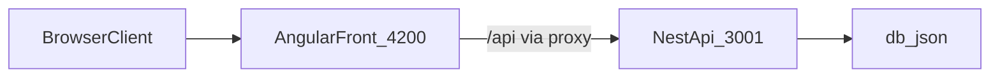

# Taskflow

Taskflow разделен на два независимых приложения в одном репозитории:

- `front` - Angular frontend (UI, SSR, PWA, i18n)
- `back` - NestJS backend API

## Релизы

- Гайд по релизам через теги: [RELEASE.md](RELEASE.md)

## Требования

- Node.js 20+ (рекомендуется для текущего стека Angular/Nest)
- npm (во frontend зафиксирован `npm@10.8.2` в `front/package.json`)

## Быстрый старт

Установите зависимости в обоих приложениях:

```bash
cd front
npm install

cd ../back
npm install
```

- Что делает: скачивает и фиксирует зависимости по `package-lock.json` для каждого приложения.
- Где запускать: команды `cd` и `npm install` из корня репозитория `taskflow/`.
- Признак успеха: нет `npm ERR!`, в конце вывод с количеством установленных пакетов.

## Запуск в режиме разработки

Сначала запустите backend (Терминал 1):

```bash
cd back
npm run start:dev
```

Backend работает на `http://localhost:3001` и отдает API с префиксом `/api`.

- Что делает: запускает Nest API в watch-режиме на порту `3001`.
- Где запускать: в каталоге `back/`.
- Признак успеха: в логах есть сообщение о старте приложения и слушающем порте.

Запустите frontend (Терминал 2):

```bash
cd front
npm run start
```

Frontend работает на `http://localhost:4200`.

В dev-режиме frontend вызывает `/api`, а `front/proxy.conf.json` проксирует запросы на `http://localhost:3001`.

- Что делает: поднимает Angular dev server с авто-пересборкой при изменениях.
- Где запускать: в каталоге `front/`.
- Признак успеха: в браузере открывается `http://localhost:4200`, запросы к `/api` не падают.

## Как устроено

```text
taskflow/
  front/    # Angular приложение
  back/     # NestJS API
  TODO.md   # дорожная карта проекта
```

Структура frontend (основные части):

- `front/src/app/features` - функциональные модули/экраны (`projects`, `tasks`, `settings`)
- `front/src/app/core` - инфраструктура приложения (services, guards, interceptors, models)
- `front/src/app/shared` - общие UI/domain части

Структура backend (основные части):

- `back/src/projects.controller.ts`, `back/src/tasks.controller.ts` - REST endpoints
- `back/src/projects.service.ts`, `back/src/tasks.service.ts` - бизнес-логика
- `back/src/db-file.service.ts` - файловая персистентность
- `back/db.json` - локальный файл данных

## Поток данных



## Примечания по API

- Backend задает глобальный префикс в `back/src/main.ts`: `/api`
- Базовый URL во frontend в `front/src/environments/environment.ts`: `apiUrl: '/api'`

Основные endpoints:

- `GET /api/projects`
- `GET /api/projects/:id`
- `POST /api/projects`
- `GET /api/tasks`
- `POST /api/tasks`
- `PATCH /api/tasks/:id`

## Полезные команды

Frontend (`front`)

```bash
npm run start
npm run build
npm run test
npm run e2e
npm run lint
```

- `npm run start` - локальная разработка.
- `npm run build` - production-сборка.
- `npm run test` - unit-тесты.
- `npm run e2e` - e2e-тесты (Playwright).
- `npm run lint` - проверка ESLint.

Backend (`back`)

```bash
npm run start:dev
npm run build
npm run test
npm run test:e2e
npm run lint
```

- `npm run start:dev` - API в watch-режиме.
- `npm run build` - сборка backend в `dist`.
- `npm run test` - unit-тесты Jest.
- `npm run test:e2e` - e2e-тесты backend.
- `npm run lint` - ESLint-проверка backend.

## Мини-чеклист первого запуска

1. Установить зависимости в `front/` и `back/`.
2. Запустить `back` командой `npm run start:dev`.
3. Запустить `front` командой `npm run start`.
4. Открыть `http://localhost:4200`.
5. Убедиться, что данные проектов/задач загружаются без ошибок в консоли сети.

## Частые проблемы

- Порт уже занят:
  - стандартный порт frontend - `4200`
  - стандартный порт backend - `3001`
  - как проверить, кто занял порт:
    ```bash
    lsof -i :4200
    lsof -i :3001
    ```
  - как освободить порт (по PID из вывода `lsof`):
    ```bash
    kill -15 <PID>
    ```
  - если процесс не завершился:
    ```bash
    kill -9 <PID>
    ```
  - после этого перезапустите нужный сервис (`npm run start` или `npm run start:dev`).
- Запросы `/api` падают во frontend:
  - убедитесь, что backend запущен
  - проверьте, что `front/proxy.conf.json` указывает на `http://localhost:3001`
- Ошибки зависимостей:
  - выполните `npm install` отдельно в `front` и `back`
