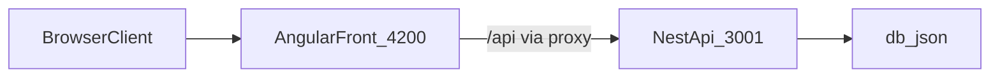

# Taskflow

Taskflow разделен на два независимых приложения в одном репозитории:

- `front` - Angular frontend (UI, SSR, PWA, i18n)
- `back` - NestJS backend API

## Релизы

- Гайд по релизам через теги: [RELEASE.md](RELEASE.md)

## Требования

- Node.js 20+ (рекомендуется для текущего стека Angular/Nest)
- npm (во frontend зафиксирован `npm@10.8.2` в `front/package.json`)

## Быстрый старт

Сначала установите root-зависимости репозитория (git hooks и pre-commit tooling):

```bash
npm install
```

- Что делает: устанавливает зависимости из `taskflow/package.json` и активирует `husky` hooks через `prepare`.
- Где запускать: в корне репозитория `taskflow/`.
- Признак успеха: нет `npm ERR!`, появился `node_modules/` в корне, команды pre-commit доступны.

После этого установите зависимости в обоих приложениях:

```bash
cd front
npm install

cd ../back
npm install
```

- Что делает: скачивает и фиксирует зависимости по `package-lock.json` для каждого приложения.
- Где запускать: команды `cd` и `npm install` из корня репозитория `taskflow/`.
- Признак успеха: нет `npm ERR!`, в конце вывод с количеством установленных пакетов.

## Запуск в режиме разработки

Сначала запустите backend (Терминал 1):

```bash
cd back
npm run start:dev
```

Backend работает на `http://localhost:3001` и отдает API с префиксом `/api`.

- Что делает: запускает Nest API в watch-режиме на порту `3001`.
- Где запускать: в каталоге `back/`.
- Признак успеха: в логах есть сообщение о старте приложения и слушающем порте.

Запустите frontend (Терминал 2):

```bash
cd front
npm run start
```

Frontend работает на `http://localhost:4200`.

В dev-режиме frontend вызывает `/api`, а `front/proxy.conf.json` проксирует запросы на `http://localhost:3001`.

- Что делает: поднимает Angular dev server с авто-пересборкой при изменениях.
- Где запускать: в каталоге `front/`.
- Признак успеха: в браузере открывается `http://localhost:4200`, запросы к `/api` не падают.

## Как устроено

```text
taskflow/
  front/              # Angular приложение
  back/               # NestJS API
  .husky/             # git hooks
  package.json        # root tooling (husky/lint-staged)
  .lintstagedrc.cjs   # pre-commit правила
  TODO.md             # дорожная карта проекта
```

Структура frontend (основные части):

- `front/src/app/features` - функциональные модули/экраны (`projects`, `tasks`, `settings`)
- `front/src/app/core` - инфраструктура приложения (services, guards, interceptors, models)
- `front/src/app/shared` - общие UI/domain части
- Angular-компоненты в `front/src/app` разделены по файлам: `*.component.ts`, `*.component.html`, `*.component.css|scss`
- Внутри feature-папок крупные компоненты разложены по подпапкам: например `features/projects/{list,board,card}` и `features/tasks/{board,card,create-dialog}`
- В карточке задачи отображаются `description`, `dueDate` (формат `dd.MM.yyyy`) и `tags`; create/edit формы поддерживают эти поля

Структура backend (основные части):

- `back/src/projects.controller.ts`, `back/src/tasks.controller.ts` - REST endpoints
- `back/src/projects.service.ts`, `back/src/tasks.service.ts` - бизнес-логика
- `back/src/db-file.service.ts` - файловая персистентность
- `back/db.json` - локальный файл данных

## Поток данных



## Примечания по API

- Backend задает глобальный префикс в `back/src/main.ts`: `/api`
- Базовый URL во frontend в `front/src/environments/environment.ts`: `apiUrl: '/api'`

Основные endpoints:

- `GET /api/projects`
- `GET /api/projects/:id`
- `POST /api/projects` (`name` обязателен, `description?`, `author?`)
- `PATCH /api/projects/:id` (частичное обновление `name?`, `description?`, `author?`)
- `GET /api/tasks?projectId=<project-id>` (для списка задач конкретного проекта)
- `POST /api/tasks`
- `PATCH /api/tasks/:id`

## Как поменять язык

В проекте настроены локали `en-US` (исходная) и `ru`.

- Где настраивается:
  - `front/angular.json` -> `i18n.sourceLocale` и `i18n.locales.ru`
  - переводы: `front/src/locale/messages.ru.xlf`

- Сборка всех локалей:

  ```bash
  cd front
  npm run build:i18n
  ```

- Сборка только русского:

  ```bash
  cd front
  npm run build:i18n:ru
  ```

- Обновить файл переводов после изменения `i18n`-строк:
  ```bash
  cd front
  npm run extract:i18n
  ```

Важно: сейчас переключение языка работает как build-time i18n (через локализованные сборки), а не как runtime-переключатель кнопкой внутри UI.

## Pre-commit (Husky + lint-staged)

В репозитории используется root-level pre-commit workflow: hook запускается из корня и проверяет только staged-файлы.

Установка:

```bash
npm install
```

- Что делает: ставит root dev-зависимости (`husky`, `lint-staged`) и активирует git hooks через `prepare`.
- Где запускать: в корне репозитория `taskflow/`.
- Признак успеха: при `git commit` автоматически запускаются проверки pre-commit.

Какие бывают конфиги:

- `Минимальный` - только `prettier --write` для staged-файлов; самый быстрый, но слабее защищает от проблем.
- `Сбалансированный` - `prettier` + точечный `eslint` только для staged-файлов (`front/src` и `back/src|test`); лучший дефолт для ежедневной разработки.
- `Строгий` - добавляет `typecheck`/тесты в pre-commit; выше качество проверки, но медленнее коммиты (обычно лучше переносить в pre-push/CI).

Выбранный режим в Taskflow: `Сбалансированный`.

- Для `front/src/**/*.{ts,js,html,css,scss}` запускаются `eslint --fix` и `prettier --write`.
- Для `back/{src,test}/**/*.{ts,js}` запускаются `eslint --fix` и `prettier --write`.
- Для `*.{json,md,yml,yaml}` запускается `prettier --write`.

Временный пропуск hook (только в исключительных случаях):

```bash
git commit --no-verify -m "your message"
```

После `--no-verify` обязательно прогоните проверки вручную и исправьте проблемы до PR.

## Полезные команды

Frontend (`front`)

```bash
npm run start
npm run build
npm run test
npm run e2e
npm run lint
```

- `npm run start` - локальная разработка.
- `npm run build` - production-сборка.
- `npm run test` - unit-тесты.
- `npm run e2e` - e2e-тесты (Playwright).
- `npm run lint` - проверка ESLint.

Backend (`back`)

```bash
npm run start:dev
npm run build
npm run test
npm run test:e2e
npm run lint
```

- `npm run start:dev` - API в watch-режиме.
- `npm run build` - сборка backend в `dist`.
- `npm run test` - unit-тесты Jest.
- `npm run test:e2e` - e2e-тесты backend.
- `npm run lint` - ESLint-проверка backend.

## Мини-чеклист первого запуска

1. Установить зависимости в `front/` и `back/`.
2. Запустить `back` командой `npm run start:dev`.
3. Запустить `front` командой `npm run start`.
4. Открыть `http://localhost:4200`.
5. Убедиться, что данные проектов/задач загружаются без ошибок в консоли сети.

## Частые проблемы

- Порт уже занят:
  - стандартный порт frontend - `4200`
  - стандартный порт backend - `3001`
  - как проверить, кто занял порт:
    ```bash
    lsof -i :4200
    lsof -i :3001
    ```
  - как освободить порт (по PID из вывода `lsof`):
    ```bash
    kill -15 <PID>
    ```
  - если процесс не завершился:
    ```bash
    kill -9 <PID>
    ```
  - после этого перезапустите нужный сервис (`npm run start` или `npm run start:dev`).
- Запросы `/api` падают во frontend:
  - убедитесь, что backend запущен
  - проверьте, что `front/proxy.conf.json` указывает на `http://localhost:3001`
- Ошибки зависимостей:
  - выполните `npm install` отдельно в `front` и `back`

## Страницы и роуты frontend

- Страницы размещаются в `front/src/app/features/<feature-name>/`.
- Главная страница: `front/src/app/features/home/home.component.ts`.
- Страница списка проектов: `front/src/app/features/projects/list/project-list.component.ts`.
- Страница доски проекта: `front/src/app/features/projects/board/project-board.component.ts`.
- Страница настроек: `front/src/app/features/settings/settings.component.ts`.
- About страница: `front/src/app/features/about/about.component.ts`.
- Корневой маршрут `''` загружает Home через lazy `loadComponent`.
- Маршрут `'projects'` загружает список проектов через lazy `loadComponent`.
- Маршрут `'projects/:id'` загружает доску проекта через lazy `loadComponent` (с guard проверки проекта).
- Маршрут `'settings'` загружает страницу настроек через lazy `loadComponent`.
- Маршрут `'about'` загружает About через lazy `loadComponent`.
- Маршрут `**` перенаправляет на `''` как fallback.

## Дорожная карта (актуализация)

- Этап липкого верхнего меню зафиксирован как **этап 14** в `front/TODO.md`.
