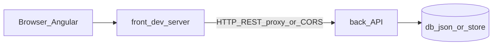

# Taskflow — общий план и дорожная карта

Корень: `taskflow/`. Фронт — `front/`, API — `back/`.

**Где детали (без дублирования длинных чеклистов)**

- **[front/TODO.md](front/TODO.md)** — Angular: раздел **«Окружение (до `ng new`)»** (= **этап 0** корневой карты ниже; отдельно от заголовков «Этап 1»…), затем подробные **этапы 1–13**; структура `src/app`, HTTP, signals, тесты и т.д.
- **[back/TODO.md](back/TODO.md)** — API: **§0** «Окружение и инструменты» (= **этап 0** корневой карты); по умолчанию **NestJS** (стабильная, контроллеры/сервисы), порты, CORS/proxy.

Нумерация подробных шагов **внутри** `front/TODO.md` и `back/TODO.md` своя; ниже — **общая** карта репозитория (этапы 0–14).

В Cursor: `@TODO.md` для обзора; `@front/TODO.md` / `@back/TODO.md` для работы по частям.

**Учебный проект:** терминал, **установка пакетов**, **Git**, **`curl`** и любые утилиты выполняете **вы сами**. В [front/TODO.md](front/TODO.md) и [back/TODO.md](back/TODO.md) каждая команда сопровождается **подпунктами**: *что делает*, *откуда запускать*, *признак успеха* (и при необходимости *типичная ошибка*) — единый шаблон в разделе **«Формат описания команд»** ниже. Смысл учёбы — читать вывод и связывать его с файлами в репозитории.

**Бэкенд по умолчанию** для учебного пути — **NestJS** последней стабильной версии (API в `back/`).

Для агента: не удалять чужие `console.log` и комментарии; не читать `.env`; менять только относящееся к задаче. При добавлении шагов с командами в `front/TODO.md` / `back/TODO.md` — **оформлять по шаблону** из раздела ниже (команда + расшифровка для ученика). Текст коммита — формат **`T-<N> <тип>: …`** из раздела «Сообщения коммитов» (номер **N** подставляет ученик; описание после двоеточия — **только на английском**). Перед **`git commit`** агент **всегда** сначала предлагает сообщение **на согласование**, без отдельной просьбы ученика: либо форма **AskQuestion** в Cursor (см. [.cursor/rules/taskflow-commits.mdc](.cursor/rules/taskflow-commits.mdc)), либо явный текст в чате; **не коммитить молча** до подтверждения. После подтверждения в AskQuestion или ответа «ок» / «коммить» / правки — можно выполнить `git commit`; ученик может вместо этого закоммитить **сам** (удобно: задача **«git: commit staged (confirm message)»** в [.vscode/tasks.json](.vscode/tasks.json) — поле ввода с сообщением, Enter = подтвердить).

**Важно (обязательное правило):** перед **каждым** коммитом агент обязан показать пользователю предлагаемый текст коммита и дождаться явного согласования; без подтверждения коммит не выполняется.

---

## Формат описания команд в чеклистах

Используется во [front/TODO.md](front/TODO.md) и [back/TODO.md](back/TODO.md). **Вы** вводите команду в терминале; текст в TODO объясняет **зачем** она.

Для **каждой** команды (shell, `npm` / `npx` / `ng`, `git`, `curl`, …) в чеклисте держите блок:

1. **Команда** — одна строка или блок кода для копирования.
2. **Что делает** — простым языком: какие файлы или каталоги меняет, нужен ли интернет, что означают важные флаги.
3. **Где** — из какого каталога запускать (`taskflow/`, `front/`, `back/`, корень git-репозитория и т.д.).
4. **Успех** — что увидеть в stdout/stderr или какие файлы появились/изменились.
5. **Частая ошибка** (по желанию) — фрагмент сообщения и что проверить (версия Node, не та папка, занятый порт).

Для **Git** тот же блок: например `git status` → показывает отслеживаемые изменения; запуск из корня репозитория; успех — список веток и файлов без `fatal:`.

**Пример оформления одного шага**

- **Команда:** `npm install @nestjs/cli --save-dev`  
  - **Что делает:** добавляет Nest CLI в devDependencies проекта, чтобы запускать команды Nest в `back/`.  
  - **Где:** каталог `back/` (там лежит ваш `package.json`).  
  - **Успех:** в конце нет `npm ERR!`; в `package.json` появилась строка с `@nestjs/cli`.

**Пример для Git**

- **Команда:** `git commit -m "T-1 feat: add Angular app skeleton"`  
  - **Что делает:** создаёт коммит из уже проиндексированных (`git add`) изменений.  
  - **Где:** корень репозитория с `.git`.  
  - **Успех:** вывод с `[main abc1234]` или аналог; `nothing to commit` если индекс пуст.  
  - **Частая ошибка:** `nothing added to commit` — забыли `git add`.

Дальнейшие разделы во `front/` и `back/` дополняются в том же стиле.

---

## Сообщения коммитов (соглашение)

Одна строка в `-m "..."`. Текст **после** `<тип>:` — **только на английском**: короткий **imperative** (как в Conventional Commits: *add*, *fix*, *update*, …) или очень краткое нейтральное описание; без кириллицы в сообщении коммита.

**Шаблон:** `T-<N> <тип>: <what changed in English>`

- `**T`** — сокращение от **Taskflow** (метка репозитория в истории).
- `**<N>`** — **номер коммита** по порядку вашей работы: `1`, `2`, `3`, … Перед **каждым** новым коммитом увеличивайте **N** на 1 (удобно смотреть порядок в `git log --oneline`). Нумерацию ведёте вы сами.
- `**<тип>`** — **область / категория** изменения (как в [Conventional Commits](https://www.conventionalcommits.org/), без скобок):
  - `**feat`** — новая возможность (UI, API, поведение).
  - `**fix**` — исправление ошибки.
  - `**docs**` — только документация и планы (`TODO.md`, `front/TODO.md`, `back/TODO.md`, README).
  - `**chore**` — инфраструктура, зависимости, конфиги без смены смысла фичи.
  - `refactor` — перестройка кода без изменения внешнего поведения.
  - `**test**` — тесты.
- После `**<тип>:**` — пробел и одна короткая фраза **на английском** (что сделал коммит).

**Примеры**

- `T-1 feat: add new input field`
- `T-2 feat: add project list with reactive form`
- `T-3 docs: clarify REST contract and /api prefix in TODO`
- `T-4 fix: correct task filter by projectId`
- `T-5 chore: add root gitignore for node_modules`

**Избегать**

- Кириллицу в сообщении коммита (описание — только EN).
- Пропускать `T-<N>` или дублировать один и тот же **N** для разных коммитов (если не исправляете историю осознанно).
- Расплывчатых описаний: `T-6 feat: update`, `T-7 fix: changes`.
- Одного огромного коммита на несвязные вещи — учебе полезнее **атомарные** коммиты; номер **N** всё равно увеличивается на каждый коммит.

---

## Цель продукта

**Taskflow:** проекты и задачи, Kanban по статусам, позже DnD и фильтры. UI — Angular в `front/`. Данные — REST из `back/`.

---

## Структура репозитория

```text
taskflow/
  TODO.md           ← этот файл: цель, контракт, порядок, краткая карта
  front/
    TODO.md         ← чеклист Angular
    …               ← код (ng new …)
  back/
    TODO.md         ← чеклист API
    …               ← NestJS (API)
```

---

## Поток данных




---

## REST-контракт (общий для `back/`)

Согласуйте префиксы с **proxy** в Angular или с **CORS** — один вариант зафиксировать в [back/TODO.md](back/TODO.md) и в `front/proxy.conf.json`.

**Префикс путей (важно для Nest):** ниже перечислены **логические** ресурсы REST. При **NestJS** маршруты обычно вешаются под глобальный префикс **`/api`**, то есть фактические URL чаще **`/api/projects`**, **`/api/tasks`**, **`/api/tasks/:id`** — задайте в `front/` базовый URL (например `environment.apiUrl = '/api'`) и proxy так, чтобы совпадало с [back/TODO.md](back/TODO.md). 

- `GET /projects` — список проектов
- `GET /projects/:id` — один проект (в Nest обычно `GET /api/projects/:id` через контроллер)
- `POST /projects` — создать (`name`, опционально `description`; сервер: `id`, `createdAt`)
- `GET /tasks?projectId=:id` — задачи проекта
- `POST /tasks` — создать задачу
- `PATCH /tasks/:id` — частично (`status`, `order`, поля формы)

Этап **4** дорожной карты ниже = подключение **`back/`** + HTTP на фронте; детализация только в подпапочных TODO.

**Идентификаторы:** `Project.id` и `Task.id` (а также `Task.projectId`) — **строки в формате UUID v4** (RFC 4122). На фронте для новых сущностей до API используйте пакет **`uuid`** (`v4 as uuidv4`); в `back/` в JSON те же строковые UUID.

**Project:** `id` (UUID string), `name`, `description?`, `createdAt` (ISO string).

**Task:** `id` (UUID string), `projectId` (UUID string), `title`, `description?`, `status` (`backlog` | `in_progress` | `done`), `priority` (`low` | `medium` | `high`), `dueDate?`, `tags[]`, `order` (число, для DnD).

---

## Порядок работ

1. Окружение и каркас Angular — [front/TODO.md](front/TODO.md).
2. Домен и UI без API, роуты `/projects`, `/projects/:id` — там же.
3. Поднять `back/` и HTTP на фронте — [back/TODO.md](back/TODO.md) + раздел «HTTP и API» в [front/TODO.md](front/TODO.md).
4. Signals и синхронизация с API — [front/TODO.md](front/TODO.md).
5. Остальное (формы, CDK, фильтры, **тесты** — порядок и приоритеты в **§9.0** [front/TODO.md](front/TODO.md), SSR, i18n, PWA, a11y) — по оглавлению там же.

**Выбор `back/`:** путь — **NestJS stable**, контроллеры в `src/...`, отдельный порт (например `3001`), CORS или proxy.

---

## Риски

- SSR Angular + API: заранее **proxy** или **CORS**; при `withFetch()` проверить сервер и браузер.
- **Nest + Angular** в dev: две Node-зависимости; при странностях сверить версии Node/пакетов и не смешивать два `back` на одном порту.
- Быстрый DnD: гонки PATCH — позже очередь/дебаунс на клиенте (и на `back` при записи в файл — см. [back/TODO.md](back/TODO.md)).
- PWA: не кэшировать агрессивно API в dev.
- Апгрейды Angular: [angular.dev/update](https://angular.dev/update).

---

## Дорожная карта по этапам (только кратко)

Отмечайте здесь **общий** прогресс. Подзадачи — только в [front/TODO.md](front/TODO.md) и [back/TODO.md](back/TODO.md). Выполненные пункты в чеклистах: `[ ]` → `[x]`; по желанию после `[x]` ставьте **✅**, чтобы в превью редактора было заметнее (см. шапку [front/TODO.md](front/TODO.md)).

- ✅ **0** Окружение (Node, Angular CLI, DevTools) — [front/TODO.md](front/TODO.md) (блок до «Этап 1»), [back/TODO.md](back/TODO.md) (§0)
- ✅ **1** Каркас `front/` (routing, SCSS, standalone, strict TS; **CSR** до этапа 10, см. [front/TODO.md](front/TODO.md))
- ✅ **2** Домен и UI без сервера (модели, список проектов, Kanban без DnD)
- ✅ **3** Роутинг `/projects`, `/projects/:id`, lazy/guard по необходимости
- ✅ **4** Данные: `back/` + HTTP на фронте (см. оба TODO в подпапках)
- ✅ **5** Signals и синхронизация с API
- ✅ **6** Формы и базовая a11y
- ✅ **7** CDK DnD, `order`, PATCH
- ✅ **8** Фильтры, debounce, `track` в `@for`
- ✅ **9** Тесты (unit, негативные сценарии; E2E по желанию)
- ✅ **10** SSR, TransferState, Title/Meta
- ✅ **11** i18n
- ✅ **12** PWA
- ✅ **13** Доступность
- **14** На вырост: ACL, toasts, история, Nest + WebSocket и др. — опциональный post-MVP этап, см. [back/TODO.md](back/TODO.md) §6 «На вырост»

**Ориентир папок во `front/`:** `core/`, `shared/`, `features/projects/`, `features/tasks/`; внутри фич допустимы подпапки по компонентам, например `projects/{list,board,card}` и `tasks/{board,card,create-dialog}` — см. [front/TODO.md](front/TODO.md).

**Ритм:** после крупного этапа — **коммит в Git** сами; сообщения — по разделу **«Сообщения коммитов»** выше; шаги `git` — в [front/TODO.md](front/TODO.md) («Ритм»).